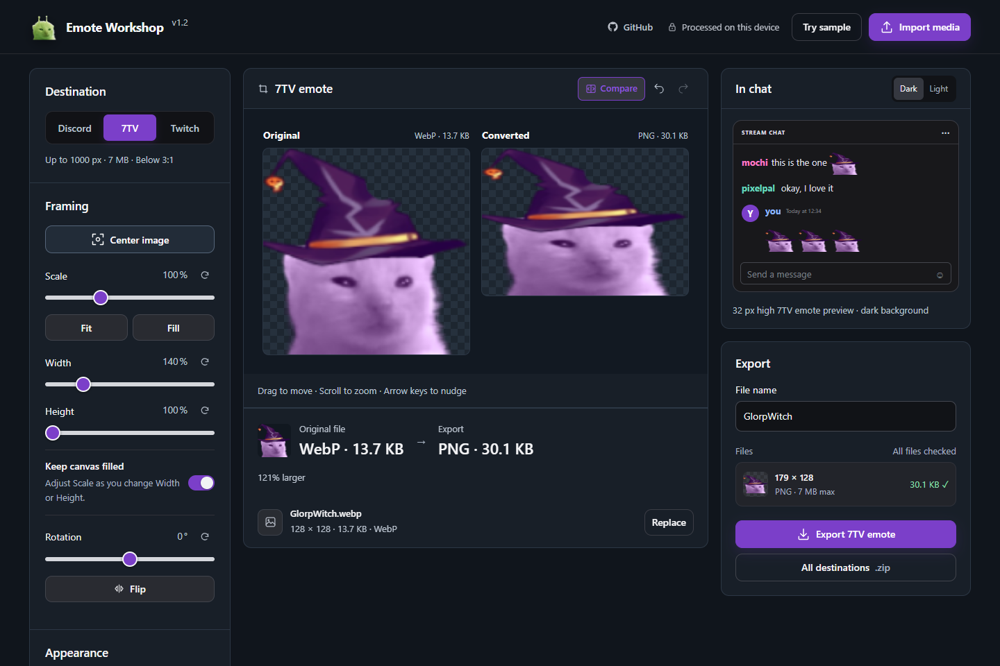

# Emote Workshop

A private, browser-based emote editor for Twitch, Discord, and 7TV.

## How to use

1. **[Open Emote Workshop](https://emotes.gimba.uk)** in Chrome or Edge.
2. Import an image, animation, MP4, or 7TV emote link — or choose **Try sample**.
3. Select Twitch, Discord, or 7TV and adjust the framing while checking the live previews.
4. Use **Compare** to inspect the original beside the converted file, including its format and size.
5. Enter a file name and export the current destination or every destination at once.

Everything is processed on your device; no account or upload is required. For a fully offline copy, download and open **Emote Workshop.html** in Chrome or Edge.



## What it makes

Import PNG, JPEG, GIF, WebP, AVIF, or MP4 (animated sources supported), or paste a 7TV emote page/CDN link to import one of its 1x–4x renditions. The largest 4x AVIF is the default, with WebP, GIF, and PNG available when the emote provides them. Then pick a destination, adjust framing, and export:

- **Twitch** manual-upload packs at 112×112, 56×56, and 28×28, with animated exports limited to 512 KB and 60 frames
- **Discord** emoji at 128×128 and stickers at 320×320
- **7TV** up to 1000×1000 and 7 MB, preserving aspect ratio without upscaling, with an AVIF-first export preference plus WebP and GIF choices

The editor keeps separate framing for each destination, with undo/redo, drag or keyboard positioning, center snapping, rotation, flip, fit/fill, transparent-margin trimming, width/height stretching, outlines, and brightness. **Keep canvas filled** can update Scale automatically while Width or Height changes.

For animation, use the filmstrip to resize or drag the selected frame range, adjust playback speed, and preview the canvas independently from the chat example. The full selected duration is retained when the destination's file-size and frame-count limits allow it; longer animations are sampled progressively when needed instead of being cut off at five seconds. Animated exports are GIF (Twitch/Discord emoji) or APNG (Discord stickers); static sources export as PNG.

For 7TV, AVIF is the default preference, WebP and GIF can be selected directly, and the produced format is always shown before download. Current Chrome and Edge releases do not expose animated AVIF encoding to web applications, so animated AVIF requests automatically fall back to animated WebP and then GIF while preserving timing and transparency.

The original and converted formats, file sizes, dimensions, and destination limits are checked before download. **Compare** shows the untouched source and actual converted output side by side on larger screens, with an Original/Converted switch on mobile. All media processing is local. The content security policy permits downloads only from 7TV's media CDN when you explicitly import a 7TV link; local-file workflows remain fully offline. Following an explicit GitHub link leaves the offline editor.

Choose **Try sample** to try it with the included sample artwork.

## Development

Requirements: Node.js 22+, and for the independent GIF verification Python 3.12+ with Pillow.

```text
npm ci
npm run dev        # optional local server at http://127.0.0.1:4173
npm run build      # rebuild Emote Workshop.html after editing dist/
npm run check      # syntax, formatting, offline-build freshness
npm test           # full test suite
npm run test:gif:verify  # independent GIF verification (needs Python + Pillow)
```

- `dist/` is authored source, not disposable build output — commit changes to it.
- **Emote Workshop.html** is generated but intentionally committed; rebuild it whenever `dist/` changes.
- `npm run format` formats; browser tests use an installed Chrome (`npx playwright install chrome`).
- The GitHub Actions workflow runs these checks on pushes and pull requests.

## Project policies

- [Contributing](CONTRIBUTING.md)
- [Security policy](SECURITY.md)
- [Release process](docs/releasing.md)
- [Artwork and third-party assets](ASSETS.md)
- [MIT license](LICENSE)
