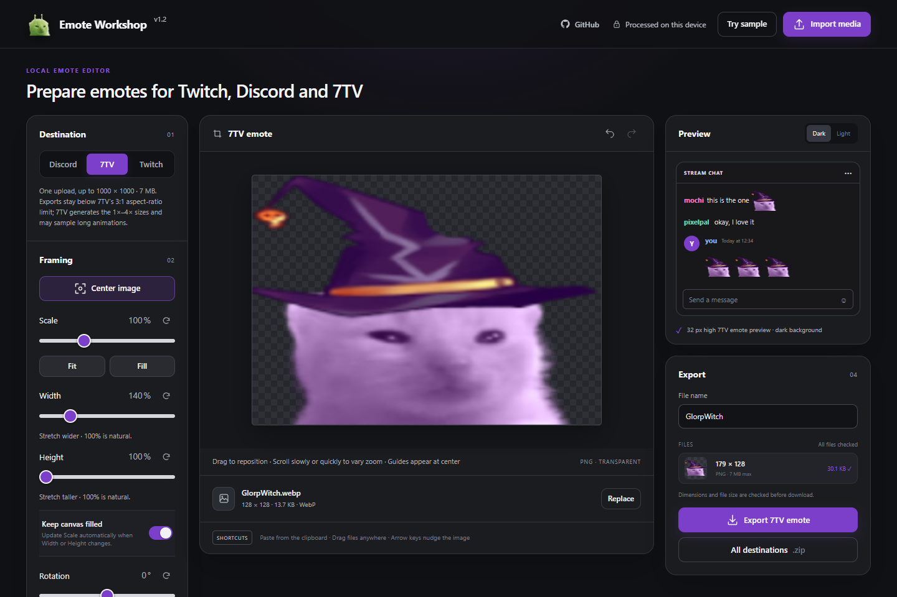

# Emote Workshop

A private, browser-based emote editor for Twitch, Discord, and 7TV.

## How to use

1. **[Open Emote Workshop](https://emotes.gimba.uk)** in Chrome or Edge.
2. Import an image, animation, or MP4 — or choose **Try sample**.
3. Select Twitch, Discord, or 7TV and adjust the framing while checking the live previews.
4. Enter a file name and export the current destination or every destination at once.

Everything is processed on your device; no account or upload is required. For a fully offline copy, download and open **Emote Workshop.html** in Chrome or Edge.



## What it makes

Import PNG, JPEG, GIF, WebP, AVIF, or MP4 (animated sources supported), pick a destination, adjust framing, and export:

- **Twitch** manual-upload packs at 112×112, 56×56, and 28×28, with animated exports limited to 512 KB and 60 frames
- **Discord** emoji at 128×128 and stickers at 320×320
- **7TV** up to 1000×1000 and 7 MB, preserving aspect ratio without upscaling

Features: per-destination framing and undo/redo, drag/keyboard positioning with snapping, rotation, flip, fit/fill, transparent-margin trimming, width/height stretching, outlines, brightness, animation trim (filmstrip with start/end handles), speed control, dark/light chat previews, and file size/dimension limit checks. Animated exports are GIF (Twitch/Discord emoji) or APNG (Discord stickers); static sources export as PNG. All media processing is local, and the content security policy blocks application-initiated network connections. Following an explicit GitHub link leaves the offline editor.

Choose **Try sample** to try it with the included sample artwork.

## Development

Requirements: Node.js 22+, and for the independent GIF verification Python 3.12+ with Pillow.

```text
npm ci
npm run dev        # optional local server at http://127.0.0.1:4173
npm run build      # rebuild Emote Workshop.html after editing dist/
npm run check      # syntax, formatting, offline-build freshness
npm test           # full test suite
npm run test:gif:verify  # independent GIF verification (needs Python + Pillow)
```

- `dist/` is authored source, not disposable build output — commit changes to it.
- **Emote Workshop.html** is generated but intentionally committed; rebuild it whenever `dist/` changes.
- `npm run format` formats; browser tests use an installed Chrome (`npx playwright install chrome`).
- The GitHub Actions workflow runs these checks on pushes and pull requests.

## Project policies

- [Contributing](CONTRIBUTING.md)
- [Security policy](SECURITY.md)
- [Release process](docs/releasing.md)
- [Artwork and third-party assets](ASSETS.md)
- [MIT license](LICENSE)
